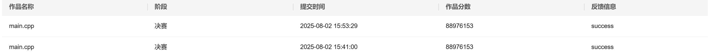
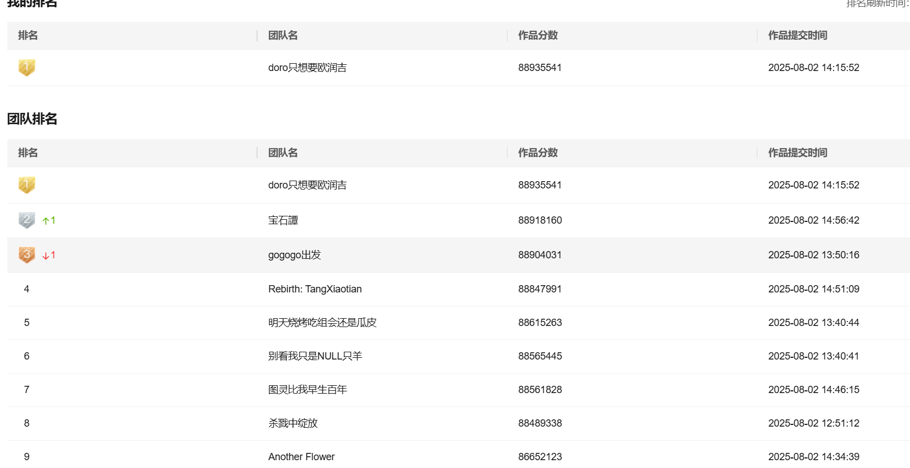
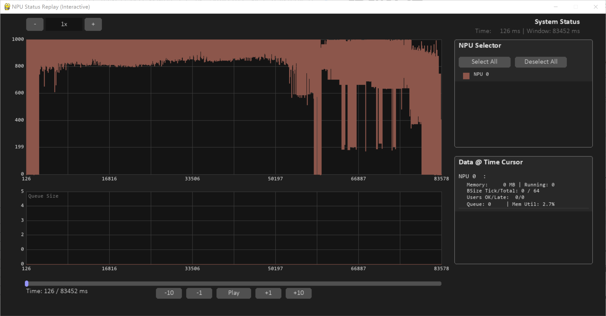

# 2025 华为嵌入式软件大赛（算法组）冠军方案

## 🏆 比赛成绩
- **最终排名**: 冠军 🥇
- **冠军队伍**: doro只想要欧润吉
- **得分**: 88,970,000+
- **亚军队伍**: gogogo出发
- **亚军得分**: 88,920,000+

## 📸 比赛截图

##  相关链接
- **亚军队伍方案**: [https://github.com/jiuwen236/hwict2025](https://github.com/jiuwen236/hwict2025)

---

## 📋 前言
在比赛结束后，被很多队伍追要源代码，我都以代码太乱为由回拒了。思来想去，最终还是决定开源一下代码。**本代码即为赛时提交代码，没有做任何更改。**

## ✨ 算法策略特点

###  核心优势
1. **零超参数**: 代码中不含有任何超参数，不需要针对任何数据做调参，具有足够的通用性
2. **无NPU转移**: 程序保证每个用户的请求都在同一个NPU上完成，没有任何NPU转移的惩罚

###  设计理念
- **第一优先级**: 准时完成请求的用户数量
- **第二优先级**: 在保证准时完成的前提下，优化完成时间
- **核心目标**: 通过合适的调度，最大化准时完成请求的用户数量

---

##  赛题分析

### 🔄 赛题演进
- **初赛**: 基础版本
- **复赛**: 为每个用户赋予独立的 a 和 b 参数
- **决赛**: 为每个用户指定不同的得分（用户间得分差异很小）

###  评分函数分析
- 准时完成请求的用户数量是**第一优先级**
- 即使所有用户请求提前 10,000 个时间单位完成，总得分提升也不会超过 1%
- 赛题目的：**最大化准时完成请求的用户数量**，而非尽可能早地完成

---

##  具体策略

###  任务分解
将整个任务拆分为两个子问题：
1. **用户分配**: 将每个用户指派到哪个NPU上运行
2. **NPU调度**: 当NPU被指派一批用户后，如何调度以最大化准时完成的用户数量

###  用户分配策略
- **分配方式**: 暴力枚举所有NPU
- **分配条件**: 如果分配到某个NPU时请求能够准时完成，则指派到该NPU
- **约束条件**: 保证一个用户的请求只在单个NPU上完成

### ⚡ NPU调度策略
这是算法的核心部分，采用**按时间顺序执行**的方式。

#### 🔑 关键发现
1. **批量处理优势**: 同时处理多个小batch请求优于处理单个大batch请求
   - 例：同时处理两个16 batch请求（处理时间4）vs 处理一个36 batch请求（处理时间6）
   - 前者吞吐量：32/4 = 8，后者：36/6 = 6
2. **理论最优batch size**: b/a（在不考虑取整和发送次数约束的情况下）

#### ⚙️ 实现细节
1. **双优先队列维护**:
   - 队列1：能保证请求在当前时刻到达NPU的用户
   - 队列2：用户优先级队列
2. **优先级定义**: 最晚开始时间 = 用户规定时间e - 预计完成剩余请求的时间
3. **Batch size优化**: 考虑处理时间取整和发送次数不超过300的约束

####  动态调度策略
4. **强制空闲机制**: 为了能够在执行过程中动态调整请求batch的大小，会强制用户在一些时刻节点处不发送请求，保证NPU在接下来的某个时间节点是完全空闲的
   - 例：在t1时刻，NPU空闲，从优先队列选出优先级最高的用户，确定发送的batch，在t2时刻请求完成
   - 后续用户保证请求都在t2时刻之前完成，确保在t2时刻可以重新决定之后发送的batch大小
   - **核心思想**: 优先保证优先级最高的用户，然后用剩余用户填补剩余内存

5. **Batch发送判断**: 判断某个用户在某个时刻能否发送一个batch需要分情况讨论
   - **优先级最高用户**: batch发送需要更严格
     - 例：剩余发送次数10，剩余batch数量200，发送16的batch不被允许（剩余平均发送batch为20）
   - **填补空闲内存用户**: 发送16的batch是允许的

---

##  算法流程

###  执行步骤
1. **初始化**: 按用户占用资源多少进行排序
2. **用户分配**: 按优先级尝试分配用户到NPU，模拟执行验证可行性
3. **分类处理**: 用户分为已分配NPU和超时未分配两类
4. **超时处理**: 对超时用户再次尝试分配，直到无法分配为止
5. **最终处理**: 剩余超时用户采用简单处理策略

### ⏰ 超时用户处理策略
超时用户对分数提升不大，因为此时能够准时完成请求的用户数量不会再增多。

---

##  代码运行

###  数据集
和大多数队伍一样，构建了包含随机样例和极端样例的自定义数据集

###  评测器
- **语言**: C++（速度比Python版本快10倍+）
- **特色**: 生成两个日志文件
  - NPU执行信息日志
  - 用户请求完成信息日志
- **运行指令**: `python run.py ../benchmark1`

### 🎮 UI界面
根据NPU执行信息日志，提供可视化界面观察NPU执行情况，便于问题排查。

- **运行指令**: `python replay_pygame.py --file simulation_log.txt`
- **界面示例**:

---

##  总结
本方案的核心在于**最大化准时完成请求的用户数量**，通过合理的用户分配和NPU调度策略，在保证算法通用性的同时，实现了优异的比赛成绩。

### 🌟 方案亮点
- **算法设计**: 简洁高效，无需调参
- **调度策略**: 动态调整batch大小，最大化资源利用率
- **优先级管理**: 双队列机制，确保关键用户优先完成
- **内存优化**: 智能填补空闲内存，提升整体吞吐量

算法具有很好的实用价值和通用性，适用于类似的资源调度场景。